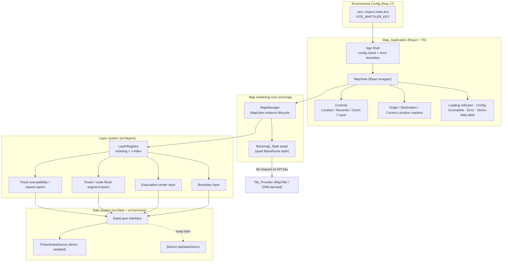
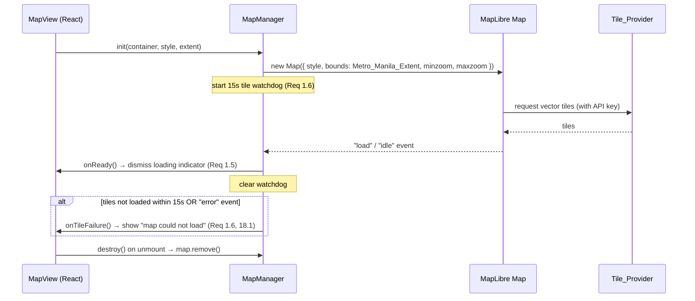
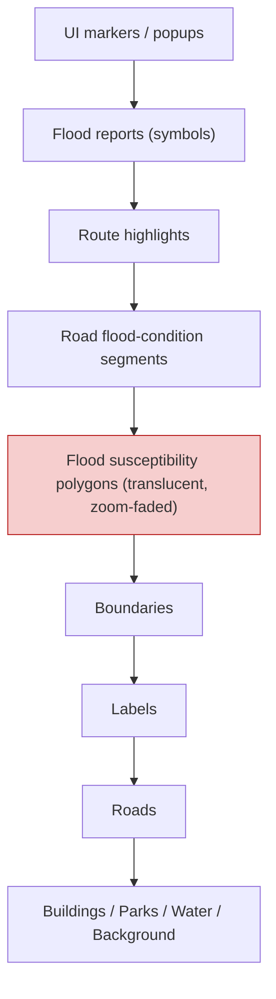
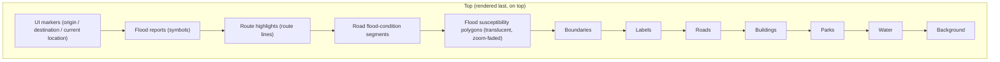
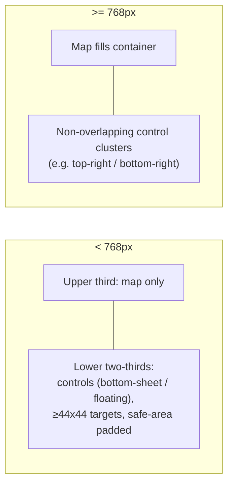

# Design Document — Milestone 1: Custom Metro Manila Map Foundation

## Overview

This document designs **Milestone 1** of BahaRoute: a polished, interactive, customized Metro Manila (NCR-only) navigation map that serves as the foundation for future flood-aware routing. The map is intentionally **visually quiet** so that flood information layered on top (in later milestones) becomes the prominent, foreground concern (Req 2).

Scope of this milestone:

- Render an interactive MapLibre GL JS map framed on the NCR, styled with a custom quiet BahaRoute basemap (Req 1, 2, 3, 4, 5).
- Provide core map controls: location, recenter, zoom, layer toggling, origin/destination markers (Req 5, 6, 7, 8, 9).
- Deliver responsive mobile/desktop layouts and full keyboard/AA accessibility (Req 10, 11).
- Establish **architecture readiness**: typed flood/route/evacuation data models, a `DataLayer` interface abstraction, and isolated, clearly-labeled fixture data (Req 12, 14, 15, 16).
- Handle configuration and failures gracefully (Req 17, 18).
- Enforce safety framing: no "safe route", no numeric safety score, GRAY is never "no risk" (Req 13).

Explicitly **out of scope** for Milestone 1: a full routing engine, turn-by-turn navigation, nationwide support, and AI-based routing (Req 16.4, 16.5). Route/evacuation types are defined and exposed as data layers, but not computed.

Adopted greenfield stack:

| Concern | Choice | Rationale |
| --- | --- | --- |
| Framework | React 18 + TypeScript | Component model + static types for data-model readiness (Req 12, 16). |
| Build tool | Vite | Fast dev server, first-class env-var handling (`import.meta.env`) for API keys (Req 17). |
| Map renderer | MapLibre GL JS (v4+) | Open-source, WebGL vector rendering, style-driven appearance, zoom-interpolated paint (Req 1, 2, 4). Content was rephrased for compliance with licensing restrictions from the [MapLibre GL JS docs](https://maplibre.org/maplibre-gl-js/docs). |
| Tiles | OSM-derived vector tiles via a provider (e.g. MapTiler) | OSM-derived data rendered through a custom style (Req 2.4); provider is swappable behind the style asset. |
| Styling | CSS Modules / plain CSS with CSS custom properties | Safe-area insets, breakpoints, contrast tokens (Req 10, 11). |
| Testing | Vitest + React Testing Library + fast-check | Unit, component, and property-based tests (see Testing Strategy). |

---

## Architecture

### High-level component & data flow



Key architectural decisions:

- **Rendering logic is separated from appearance.** `MapManager` owns the MapLibre instance and lifecycle; the `Basemap_Style` is a data asset that can be edited without touching rendering code (Req 2.3).
- **Every category of map data flows through a single `DataLayer` interface.** Fixtures implement it now; a real API implements it later without changing consumers (Req 15.3, 16.3, 9.4).
- **The layer system owns ordering.** A `LayerRegistry` inserts MapLibre layers in a fixed z-order so future flood/route layers slot in predictably (Req 9.1, 9.4; see Layer Ordering section).
- **The App Shell renders even without an API key** and gates tile requests on config validity (Req 17.4).

### Project structure

```
src/
  data/          Fixture data (GeoJSON + typed items), clearly labeled demo (Req 15)
    fixtures/    boundaries.ts, floodSusceptibility.ts, floodReports.ts,
                 communityReports.ts, routes.ts, routeFloodSegments.ts, evacuationCenters.ts
  map/           MapManager (MapLibre lifecycle), Metro_Manila_Extent constant,
                 basemap/  BahaRouteStyle (quiet Basemap_Style asset), colorTokens
  layers/        DataLayer interface, LayerRegistry, layer definitions + z-order,
                 flood classification / recency logic, visual mappings
  components/    MapView, controls (LocationControl, RecenterControl, ZoomControls,
                 LayerControl), markers, overlays (Loading, ConfigIncomplete, ErrorMessage,
                 DemoDataBadge, FloodPopup, Disclaimer)
  services/      env config loader, geolocation service, tile-load watchdog,
                 DataSource implementations (FixtureDataSource, future ApiDataSource)
  types/         flood.ts, report.ts, route.ts, evacuation.ts, layer.ts, config.ts
  App.tsx        App shell: config check, error boundary, layout
  main.tsx       React entry
.env.example     documents VITE_MAPTILER_KEY placeholder only (Req 17.3)
```

---

## Map rendering architecture

### MapLibre instance lifecycle (`MapManager`)

`MapManager` wraps the imperative MapLibre `Map` object and exposes a small typed API to React. React never touches the raw map object directly; `MapView` mounts a container `div` and delegates to `MapManager`.



Lifecycle rules:

- On mount, `MapManager.init` frames the map on `Metro_Manila_Extent` so the initial center is inside the NCR (Req 1.2, 1.3). The extent is a predefined bounding box constant covering the 17 NCR jurisdictions.
- `minzoom`/`maxzoom` come from the `Basemap_Style`; zoom controls and gestures are clamped to those bounds (Req 5.2, 5.5).
- A `ResizeObserver` on the container calls `map.resize()` so the map fills its container without distortion on viewport change (Req 5.3).
- On unmount, `map.remove()` releases WebGL resources; the watchdog timer is always cleared to avoid leaks.

### Custom quiet Basemap_Style asset

The `Basemap_Style` (`src/map/basemap/BahaRouteStyle`) is a MapLibre style object defined in source (Req 2.3). It renders OSM-derived provider data through the BahaRoute appearance rather than the provider default (Req 2.4).

Quietness rules (Req 2.1, 2.2):

- All base features (land, water, roads, boundaries, labels) use colors with **saturation ≤ 30%** — a muted, near-neutral palette held as color tokens in `src/map/basemap/colorTokens`.
- Colors with **saturation > 30% are reserved for flood layers** and never applied to base features. This is enforced by a build/unit-time check over the style's base layers (see Testing Strategy).
- Place labels use a deliberately low-contrast treatment (Req 3.4).
- Road hierarchy is rendered in three tiers — minor, major, expressway — with strictly ordered line widths (expressway > major > minor) and per-tier `minzoom` visibility (Req 4.1, 4.2, 4.3), implemented with zoom-interpolated `line-width`.
- No Google Maps / third-party navigation assets, icons, or branding are copied or embedded (Req 2.5).

### Tile provider integration & env-based API key

- The provider (e.g. MapTiler) supplies OSM-derived vector tiles. The provider URL and API key are injected into the style's `sources` at runtime from env config; no key is ever hardcoded or committed (Req 17.1, 17.2).
- `services/env` reads `import.meta.env.VITE_MAPTILER_KEY` and returns a typed `AppConfig` with a `hasTileKey` flag.
- `.env.example` documents the variable with a placeholder value only (Req 17.3).

### Missing-key handling

If the API key is absent at startup (Req 17.4):

1. The App Shell still renders (React tree mounts).
2. A **config-incomplete** message explains that map configuration is incomplete and how to supply the key.
3. `MapManager` is **not** initialized with a tile source — no tile request is made.
4. The app does not crash; controls that don't require tiles remain mounted.

---

## Data-layer architecture

### The `DataLayer` interface abstraction

Every category of map data is supplied through one interface so fixtures can be swapped for real APIs without changing consumers (Req 9.4, 15.3, 16.3).

```ts
// src/types/layer.ts
export type LayerId =
  | 'boundaries'
  | 'floodSusceptibility'
  | 'floodReports'
  | 'communityReports'
  | 'routes'
  | 'routeFloodSegments'
  | 'evacuationCenters';

export interface DataLayerMeta {
  id: LayerId;
  label: string;          // human text for Layer_Control (Req 9.5)
  isDemo: boolean;        // drives the demo/fixture badge (Req 15.2)
  defaultVisible: boolean;
}

export interface DataLayer<TItem = unknown> {
  readonly meta: DataLayerMeta;
  /** Returns validated items; malformed items are skipped, not thrown (Req 18.2). */
  load(): Promise<LoadResult<TItem>>;
  /** GeoJSON projection for MapLibre sources; empty layers return empty FeatureCollection (Req 18.3). */
  toGeoJSON(items: TItem[]): GeoJSON.FeatureCollection;
}

export interface LoadResult<TItem> {
  items: TItem[];
  skipped: number;        // count of malformed items skipped (Req 18.2)
  isDemo: boolean;
}

export interface DataSource {
  getLayer<TItem>(id: LayerId): DataLayer<TItem>;
  listLayers(): DataLayerMeta[];
}
```

- `FixtureDataSource` (in `src/services`) implements `DataSource` over the isolated fixtures in `src/data/fixtures`. All fixture layers report `isDemo: true` (Req 15.1, 15.2, 15.4).
- A future `ApiDataSource` implements the same `DataSource` interface; consuming components and the `LayerRegistry` are unchanged (Req 15.3, 16.3).
- Fixtures never carry AI-generated labels and never invent authoritative flood APIs (Req 15.5).

### Separate sources & layers per category

Each category is a distinct `DataLayer` with its own MapLibre source and layer(s), listed uniformly by the `Layer_Control` (Req 9.1, 9.4):

| LayerId | Item type | Rendering | Notes |
| --- | --- | --- | --- |
| `boundaries` | `BoundaryFeature` | line | 17 NCR jurisdictions; absence → no boundaries, no error (Req 3.1, 3.3) |
| `floodSusceptibility` | `FloodSusceptibility` | translucent fill polygons | historical/modeled; zoom-faded (see Visual Concept) |
| `floodReports` | `FloodReport` | symbols/markers | authoritative current/recent reports |
| `communityReports` | `CommunityReport` | distinct symbol/border | UNCONFIRMED unless verified (Req 14) |
| `routes` | `Route` / `RouteAlternative` | line | geometry only; no routing engine (Req 16.1, 16.5) |
| `routeFloodSegments` | `RouteFloodSegment` | line colored by `Flood_State` | per-segment state (Req 16.1) |
| `evacuationCenters` | `EvacuationCenter` | symbol/marker | location, name, description (Req 16.2) |

Susceptibility and reports are **separate layers with separate item types**, so historical susceptibility is never represented as current reported conditions (Req 12.2).

---

## Data Models

```ts
// src/types/flood.ts

/** Exactly these five values, no more (Req 12.1, 13.4). */
export type FloodState = 'RED' | 'ORANGE' | 'YELLOW' | 'GREEN' | 'GRAY';

export type VerificationStatus = 'VERIFIED' | 'UNCONFIRMED';

export type FloodDataType = 'SUSCEPTIBILITY' | 'REPORT' | 'COMMUNITY_REPORT';

export type SusceptibilityLevel = 'HIGH' | 'MODERATE' | 'LOW';

export interface GeoLocation {
  lng: number;
  lat: number;
}

/** Required metadata carried by every flood item (Req 12.3). Optional extras (Req 12.4). */
export interface FloodItemMetadata {
  location: GeoLocation;
  source: string;
  dataType: FloodDataType;
  updatedAt: number;                 // epoch seconds
  verificationStatus: VerificationStatus;
  severity?: string;
  depth?: number;                    // meters, if available
  description?: string;
  sourceUrl?: string;
}

/** Historical / modeled exposure — DISTINCT from a report (Req 12.2). */
export interface FloodSusceptibility {
  id: string;
  level: SusceptibilityLevel;
  /** Polygon from the FLOOD dataset geometry, never a city-boundary proxy (see Visual Concept constraint). */
  geometry: GeoJSON.Polygon | GeoJSON.MultiPolygon;
  metadata: FloodItemMetadata;       // dataType === 'SUSCEPTIBILITY'
}

/** Current / recent reported flooding (Req 12.6). */
export interface FloodReport {
  id: string;
  state: FloodState;
  /** Present only when passability is known; required for GREEN (Req 12.6). */
  passable?: boolean;
  metadata: FloodItemMetadata;       // dataType === 'REPORT'
}

// src/types/report.ts

/** Community report is a distinct category (Req 14.1). */
export interface CommunityReport {
  id: string;
  state: FloodState;
  passable?: boolean;
  metadata: FloodItemMetadata;       // dataType === 'COMMUNITY_REPORT'
  /** Non-verified community reports are marked UNCONFIRMED (Req 14.3, 14.4). */
}

// src/types/route.ts

export interface Route {
  id: string;
  geometry: GeoJSON.LineString;
  label: string;
}

export interface RouteAlternative {
  routeId: string;
  routes: Route[];                   // collection of alternatives (Req 16.1)
}

export interface RouteFloodSegment {
  routeId: string;
  segment: GeoJSON.LineString;
  state: FloodState;                 // per-segment Flood_State (Req 16.1)
}

// src/types/evacuation.ts

export interface EvacuationCenter {
  id: string;
  location: GeoLocation;             // at least location, name, description (Req 16.2)
  name: string;
  description: string;
}

// src/types/config.ts

export interface RecencyConfig {
  /** Default 21,600 seconds (6 hours), configurable (Req 12.5). */
  windowSeconds: number;
}

export const DEFAULT_RECENCY_WINDOW_SECONDS = 21_600;
```

### Validation & classification logic (pure functions, `src/layers`)

```ts
/** Rejects items missing any required metadata field (Req 12.3). */
function validateFloodMetadata(m: Partial<FloodItemMetadata>): m is FloodItemMetadata;

/**
 * Classifies a location's Flood_State from report info + recency (Req 12.6, 12.7).
 * - GREEN only when passability is known AND (now - updatedAt) <= window (Req 12.6).
 * - Absent info OR (now - updatedAt) > window → GRAY, never "no risk" (Req 12.7, 13.4).
 */
function classifyFloodState(
  report: FloodReport | undefined,
  now: number,
  recency: RecencyConfig,
): FloodState;

/** Susceptibility level → translucent color token (Req: Visual Concept mapping). */
function susceptibilityColor(level: SusceptibilityLevel): ColorToken;
```

These pure functions are the primary property-based-testing surface (see Correctness Properties).

---

## Flood Map Visual Concept

This section captures the user-supplied visual requirement for how the NCR overview must look and behave. It builds on Requirements 2 (quiet basemap), 3 (boundaries/labels), 4 (roads), 12 (susceptibility vs report distinction), 13 (safety framing), and 15 (fixtures).

### Concept: flood-risk map over a readable navigation basemap

The main NCR overview follows a **flood-risk-map concept**. Metro Manila is shown with **semi-transparent, color-coded** flood susceptibility / flood-condition polygons layered **over** a readable navigation basemap. Roads, waterways, city labels, and boundaries remain visible **underneath** — fills are always translucent, never fully opaque. This directly supports the quiet-basemap intent (Req 2) while making flood information the foreground concern.



### Zoom-dependent visual dominance

The susceptibility polygons dominate at overview zoom and recede at street level, so route detail and current reports take priority when the user zooms in.

- At **Metro Manila overview zoom** (low zoom): colored flood polygons are clearly visible and easy to read — broad susceptibility regions are prominent.
- At **street-level zoom** (high zoom): the susceptibility polygons **de-emphasize** (lower opacity / fade), and **road detail, route lines, current/recent flood reports, and road-condition segments** take priority.

This is implemented with **MapLibre zoom-interpolated paint properties** plus per-layer zoom visibility rules:

```jsonc
// floodSusceptibility fill layer — fill-opacity fades as the user zooms in
{
  "id": "flood-susceptibility-fill",
  "type": "fill",
  "source": "floodSusceptibility",
  "paint": {
    "fill-opacity": [
      "interpolate", ["linear"], ["zoom"],
      10, 0.45,   // overview: prominent
      13, 0.30,
      15, 0.12,   // street level: strongly de-emphasized
      17, 0.06
    ]
  }
}
```

- Susceptibility fill uses zoom-interpolated `fill-opacity` (prominent at ~z10, faded by ~z15–17). Content was rephrased for compliance with licensing restrictions from the [MapLibre interpolate example](https://maplibre.org/maplibre-gl-js/docs/examples/change-building-color-based-on-zoom-level/).
- Report symbols, route lines, and road-condition segments use a `maxzoom`-free definition and may use `minzoom` so they appear/strengthen at higher zoom; their opacity is not faded on zoom-in.
- Broad susceptibility polygons may set a low-zoom emphasis and, if desired, a `maxzoom` beyond which they stop drawing at extreme street zoom.

### Historical susceptibility stays visually distinct from current/recent reports

Susceptibility and reports are distinct concepts (Req 12.2), and their rendering must be distinct too:

- **Susceptibility** → translucent **area polygons** (fills over regions).
- **Current/recent reports** → **road segments, symbols, or markers** — never by recoloring whole administrative areas.

This keeps "historical/modeled exposure" and "reported now" readable as different things at a glance.

### Design constraint: flood polygons come from flood-dataset geometry, not city boundaries

**Administrative (city) boundaries must NOT be treated as flood risk** unless the actual flood dataset supplies those polygon shapes. Flood polygons must come from **flood dataset geometry**, not from reusing city-boundary geometry as a proxy for risk.

- The `boundaries` layer and the `floodSusceptibility` layer are separate sources with separate geometry.
- Demo fixtures for susceptibility must use **plausible flood-hazard-shaped polygons** (e.g. along low-lying areas and waterways) **or be clearly labeled demo** — they must not reuse city-boundary shapes as stand-ins for risk (Req 15.2, 15.4).

### Susceptibility classification → visual mapping

| Susceptibility level | Fill (translucent) | Non-color cue (Req 11.4) |
| --- | --- | --- |
| High | translucent red | dense diagonal hatch + "High" label / icon |
| Moderate | translucent orange | medium hatch + "Moderate" label / icon |
| Low | translucent yellow | light hatch + "Low" label / icon |

Because color alone must not convey status (Req 11.4, 12), each level also carries a **pattern (hatch), icon, and text label** in the legend and popup.

### Click/tap popup for a susceptibility area

Selecting a susceptibility polygon opens a popup showing:

- **Area** (name/identifier)
- **Data type** (Susceptibility)
- **Susceptibility** level (High / Moderate / Low)
- **Source**
- **Dataset date / last updated** (`updatedAt`)
- **Disclaimer**: susceptibility indicates **historical/modeled exposure and does not confirm current flooding** (Req 13.3), consistent with the no-safety-guarantee framing (Req 13).

---

## Map layer ordering & z-index strategy

The `LayerRegistry` inserts MapLibre layers in a fixed top-to-bottom order using `map.addLayer(layer, beforeId)`. Higher entries render on top. This ordering is stable so future flood/route layers slot into known positions (Req 9.1, 9.4).



Order (top → bottom): **UI markers > flood reports > route highlights > road flood-condition segments > flood susceptibility polygons > boundaries > labels > roads > buildings > parks > water > background.**

Rationale:

- Flood information sits above basemap features so it reads as foreground (Req 2), but susceptibility polygons stay **below** boundaries/labels/roads visually via translucency + zoom-fade so those base features remain visible underneath (Visual Concept). Interactive UI markers stay topmost so they're always reachable/clickable (Req 8).
- Markers use MapLibre HTML `Marker` overlays (DOM), which naturally sit above canvas layers, while the ordered list above governs the canvas (source/layer) rendering.

---

## Components and Interfaces

This section documents the component and interface design. The programmatic data interfaces (`DataLayer`, `DataSource`, `LoadResult`) are defined in the [Data-layer architecture](#data-layer-architecture) section above; the UI components that render over the map are described in the table below. Together they form the component/interface surface of Milestone 1.

All controls are React components rendered over the map container, each keyboard-operable with an accessible label and a visible focus indicator (Req 11).

| Component | Requirement | Behavior |
| --- | --- | --- |
| `LocationControl` | Req 6 | Requests geolocation; on grant places `Current_Location_Marker` and centers on it (6.2); handles denied/unavailable/timeout/out-of-NCR (6.3–6.6). |
| `RecenterControl` | Req 7 | Animates back to `Metro_Manila_Extent` within 1000 ms (7.2); no-op safe if already framed (7.3). |
| `ZoomControls` | Req 5.4, 5.5 | On-screen zoom in/out, ≥44×44 touch targets; clamps at min/max without error state. |
| `LayerControl` | Req 9 | Lists every `DataLayer` uniformly; toggle shows/hides within 500 ms (9.2); empty list shows no error (9.3); state conveyed with text + non-color cue (9.5). |
| `OriginMarker` / `DestinationMarker` | Req 8 | Exactly one of each; distinct **shape/icon** not color alone (8.2, 8.3); re-place moves existing marker (8.4); accessible role label (8.5). |
| `LoadingIndicator` | Req 1.5 | Visible while tiles load; dismissed on render. |
| `ConfigIncomplete` | Req 17.4 | Shown when API key missing; app shell still renders, no tiles requested. |
| `ErrorMessage` | Req 1.6, 18.1 | "Map could not load" on tile failure/timeout; app stays alive. |
| `DemoDataBadge` | Req 15.2 | Visible label marking fixture content as demo. |
| `FloodPopup` | Visual Concept, Req 13.3 | Susceptibility/report popup with Area, Data type, Susceptibility, Source, Dataset date, disclaimer. |
| `Disclaimer` | Req 13.3 | Accompanies any flood information; no "safe"/score language (Req 13.1, 13.2). |

Markers are placed with the map's built-in `Marker` overlay so they carry DOM nodes for accessible labels and focus.

---

## Responsive layout strategy

Breakpoint: **768 CSS pixels** (Req 10).

- **Mobile (< 768px)** — All interactive controls live in the **lower two-thirds** of the viewport height, reachable by thumb (Req 10.1). Primary controls use a floating stack / bottom-sheet pattern anchored to the bottom. Every touch target is **≥ 44×44 CSS px** (Req 10.4).
- **Desktop (≥ 768px)** — Controls are arranged so **none overlaps another** and each is fully visible within the viewport (Req 10.2), typically anchored top-right / bottom-right with spacing.
- **Safe-area insets** — Layout uses `env(safe-area-inset-*)` padding so no control renders inside a notch or system-bar region (Req 10.3).



Implementation: a CSS custom-property token set switches control placement at the 768px media query; `ResizeObserver` keeps the map canvas sized to its container (Req 5.3).

---

## Accessibility strategy

Targets WCAG 2.1 AA (Req 11). Full conformance requires manual testing with assistive technologies and expert review; this design covers the programmatic and visual foundations.

- **Keyboard operability** — Every control is a real focusable element (`button`/`role`), reachable and activatable by keyboard alone (Req 11.1). Map controls are in tab order; the map canvas exposes keyboard pan/zoom where supported.
- **Visible focus** — Focus indicator boundary has ≥ 3:1 contrast against adjacent colors (Req 11.2), implemented with a dedicated focus-ring token (not relying on the browser default alone).
- **Accessible labels** — Each control has an accessible name (`aria-label` / associated text) (Req 11.3). Origin/destination markers carry role labels (Req 8.5).
- **Non-color-alone status** — Flood states, susceptibility levels, layer on/off states, community-report UNCONFIRMED status, and origin/destination markers all use **icon / text / pattern** in addition to color (Req 8.2, 8.3, 9.5, 11.4, 14.2, 14.4). See Visual Concept mapping (hatch + label per susceptibility level).
- **Contrast** — Text ≥ 4.5:1; large text and interactive component boundaries ≥ 3:1 (Req 11.5). Basemap uses low-contrast labels by design (Req 3.4), but interactive UI controls meet AA against their own backgrounds.
- **Safety language** — No "safe", "clear", or numeric-score text anywhere; GRAY is labeled "Unknown", never "no risk" (Req 13).

---

## Error Handling

| Failure | Handling | Requirement |
| --- | --- | --- |
| Missing API key at startup | App shell renders; config-incomplete message; no tile request; no crash | 17.4 |
| Tile provider fails / tiles time out (15s) | Watchdog fires → "map could not load" message; app + controls stay interactive | 1.6, 18.1, 18.5 |
| Malformed GeoJSON source | Skip malformed source/item, count as `skipped`, continue rendering remaining layers; no uncaught error | 18.2 |
| Empty flood data layer | Render empty `FeatureCollection`; no error shown | 18.3 |
| Boundary data unavailable | Render map without boundaries, stay interactive, no error | 3.3 |
| Geolocation permission denied | Message "location access denied"; map stays on extent, interactive | 6.3, 18.4 |
| Geolocation unavailable | Message "location unavailable"; map stays interactive | 6.4, 18.4 |
| Geolocation timeout (20s) | Stop waiting; "location could not be determined"; map interactive | 6.5 |
| Detected location outside NCR | Show marker + inform "NCR only" | 6.6 |
| Zoom past min/max | Clamp; no error state | 5.5 |
| Recenter when already framed | No-op safe; no error state | 7.3 |

A React **error boundary** wraps the map subtree so an unexpected render error shows a message rather than a blank crash. Two independent timers exist: a **15s tile watchdog** (`MapManager`) and a **20s geolocation timeout** (`geolocation service`).


---

## Correctness Properties

*A property is a characteristic or behavior that should hold true across all valid executions of a system — essentially, a formal statement about what the system should do. Properties serve as the bridge between human-readable specifications and machine-verifiable correctness guarantees.*

We apply property-based testing to BahaRoute's **pure logic layer**: flood metadata validation, `Flood_State` classification against the recency window, susceptibility→visual mapping, the zoom-opacity fade function, and the `DataLayer` GeoJSON projection (skip-malformed / empty-layer). Map rendering, styling, geolocation, layout, and env handling are UI/integration/config concerns and are covered by component, example, integration, and smoke tests (see Testing Strategy), **not** by property tests.

Reflection applied to properties: the "every rendered flood item carries source + timestamp" concern is subsumed into the validation/projection property (P2), since validation gates projection. The window-boundary edge case is folded into the GREEN (P3) and GRAY (P4) classification properties rather than being a separate property.

### Property 1: Classification always yields a valid Flood_State

*For any* `FloodReport` (or absence of one), any current time `now`, and any `RecencyConfig`, `classifyFloodState` returns a value in exactly `{RED, ORANGE, YELLOW, GREEN, GRAY}` and never any other value.

**Validates: Requirements 12.1, 13.4**

### Property 2: Required metadata gates acceptance and projection

*For any* candidate flood item metadata, `validateFloodMetadata` returns true **iff** all of `location`, `source`, `dataType`, `updatedAt`, and `verificationStatus` are present; and *for any* validated flood item, its projected GeoJSON feature properties include both `source` and `updatedAt`. Items missing any required field are rejected and never projected.

**Validates: Requirements 12.3**

### Property 3: GREEN is assigned only for present-and-recent passability

*For any* `FloodReport`, `now`, and `RecencyConfig` with window `W`, `classifyFloodState` returns `GREEN` **iff** passability information is present **and** `(now − updatedAt) ≤ W`. In particular, an item whose age is exactly `W` (the window edge) still qualifies, and an item aged `W + 1` does not.

**Validates: Requirements 12.6, 12.5**

### Property 4: Absent or stale information is GRAY, never "no risk"

*For any* location whose flood information is absent, **or** whose `(now − updatedAt)` exceeds the recency window, `classifyFloodState` returns `GRAY`. `GRAY` is always a represented state and is never substituted, omitted, or relabeled as "no risk", "safe", or "clear".

**Validates: Requirements 12.7, 13.4**

### Property 5: State labels stay within the approved vocabulary

*For any* `FloodState`, its display label is drawn only from the approved RED/ORANGE/YELLOW/GREEN/GRAY vocabulary, and `GRAY` maps to an "Unknown"-style label — never to "no risk", "safe", or "clear".

**Validates: Requirements 13.4, 13.1**

### Property 6: Susceptibility and report visual treatments are mutually exclusive

*For any* flood item, the chosen visual treatment is a **translucent area-polygon fill iff** `dataType === 'SUSCEPTIBILITY'`, and a **symbol/segment (report) treatment iff** `dataType` is `'REPORT'` or `'COMMUNITY_REPORT'`. A susceptibility item is never rendered with a reports-only treatment and vice versa; the two treatment sets are disjoint.

**Validates: Requirements 12.2, 14.1**

### Property 7: Unverified community reports are marked UNCONFIRMED

*For any* `CommunityReport` whose `verificationStatus` is other than `VERIFIED`, the report is marked `UNCONFIRMED` (as a flag and a text/icon cue).

**Validates: Requirements 14.3, 14.4**

### Property 8: Susceptibility opacity is non-increasing as zoom increases

*For any* two zoom levels `z1 < z2` within the configured range, the evaluated susceptibility `fill-opacity(z1) ≥ fill-opacity(z2)`. Susceptibility polygons are therefore at least as prominent at overview zoom as at street level and never become more dominant as the user zooms in.

**Validates: Requirements 2.1, 12.2**

### Property 9: Malformed items are skipped without throwing

*For any* list of candidate items containing an arbitrary mix of valid and malformed entries, `DataLayer.load` never throws, returns exactly the valid subset as `items`, and reports `skipped` equal to the number of malformed entries.

**Validates: Requirements 18.2**

### Property 10: Empty layers project to a well-formed empty collection

*For any* empty item list, `DataLayer.toGeoJSON([])` returns a valid, well-formed empty `FeatureCollection` (type `"FeatureCollection"`, empty `features` array) and produces no error.

**Validates: Requirements 18.3**

---

## Testing Strategy

BahaRoute uses a **dual approach**: property-based tests for universal properties over pure logic, and example / component / integration / smoke tests for concrete behavior, UI, browser APIs, and configuration. Unit tests focus on specific examples, edge cases, and integration points; property tests handle broad input coverage. We avoid over-writing unit tests where a property test already covers the input space.

### Tooling

- **Vitest** — test runner (run single-shot with `vitest --run`, not watch mode).
- **React Testing Library** — component tests for controls, messages, popups, and layouts.
- **fast-check** — property-based testing library for TypeScript. We use a maintained library and do **not** implement PBT from scratch.

### Property-based tests (pure logic)

Each correctness property maps to a **single** property-based test, configured to run a **minimum of 100 iterations**, and tagged with a comment referencing the design property.

Tag format: `// Feature: baharoute-metro-manila-map-foundation, Property {number}: {property_text}`

| Property | Function under test | Generators |
| --- | --- | --- |
| P1 | `classifyFloodState` | arbitrary reports (incl. undefined), `now`, window |
| P2 | `validateFloodMetadata` + projection | metadata with random present/missing fields |
| P3 | `classifyFloodState` (GREEN branch) | reports with/without passability, ages around window incl. exact edge |
| P4 | `classifyFloodState` (GRAY branch) | absent reports + ages beyond window |
| P5 | state-label mapping | all five `FloodState` values |
| P6 | visual-treatment mapping | items across all `FloodDataType` values |
| P7 | community-report marking | community reports with random verification status |
| P8 | zoom-opacity evaluation | pairs of zoom levels in range |
| P9 | `DataLayer.load` | lists mixing valid + malformed items |
| P10 | `DataLayer.toGeoJSON` | empty input |

### Unit / example tests

- **Recency defaults & config**: `DEFAULT_RECENCY_WINDOW_SECONDS === 21600`; classification honors an overridden window (Req 12.5).
- **Optional metadata pass-through**: severity/depth/description/sourceUrl retained when present (Req 12.4).
- **Route/evacuation types**: `RouteFloodSegment.state` is a valid `FloodState`; `EvacuationCenter` carries location/name/description (Req 16.1, 16.2).
- **Basemap saturation rule**: a build/unit check asserting every base-map feature color has saturation ≤ 30% and that no reserved (>30%) color is applied to base features (Req 2.1, 2.2).

### Component tests (React Testing Library)

- **LayerControl**: lists each `DataLayer` uniformly; toggling shows/hides; empty list shows no error; state conveyed with text + non-color cue (Req 9).
- **Markers**: exactly one origin and one destination; re-placing moves the existing marker; distinct shape/icon and accessible role label (Req 8).
- **Controls accessibility**: each control is keyboard-focusable/activatable, has an accessible label, and shows a visible focus ring (Req 11.1–11.3).
- **Messaging components**: `ConfigIncomplete`, `ErrorMessage`, `LoadingIndicator`, `DemoDataBadge`, `FloodPopup` (with disclaimer), `Disclaimer` — including the constraint that no "safe"/score text appears (Req 13).
- **Community report**: UNCONFIRMED conveyed with text/icon, distinct shape/border (Req 14.2, 14.4).

### Integration / behavior tests

- **Map framing**: initial view frames `Metro_Manila_Extent` with center inside the NCR (Req 1.2, 1.3).
- **Recenter**: returns to extent within 1000 ms; no-op safe when already framed (Req 7.2, 7.3).
- **Zoom clamping**: zoom past min/max keeps level, no error state (Req 5.5).
- **Resize**: `ResizeObserver` triggers `map.resize()` (Req 5.3).

### Edge-case / failure tests (explicitly required)

- **Missing API key** — app shell renders, config-incomplete message shown, no tile request, no crash (Req 17.4). *(smoke)*
- **Tile provider failure / 15s timeout** — "map could not load" message, app stays interactive (Req 1.6, 18.1).
- **Malformed GeoJSON** — malformed source skipped, remaining layers render, no uncaught error (Req 18.2) — also covered by P9.
- **Empty flood layer** — renders empty, no error (Req 18.3) — also covered by P10.
- **Geolocation denied / unavailable / 20s timeout** — appropriate message, map stays on extent and interactive (Req 6.3, 6.4, 6.5, 18.4).
- **Out-of-NCR location** — marker shown + "NCR only" message (Req 6.6).
- **Viewports** — mobile (<768px) controls in lower two-thirds with ≥44×44 targets and safe-area insets; desktop (≥768px) non-overlapping, fully visible (Req 10).

### Why some criteria are not property-tested

Map initialization/framing, tile rendering, basemap appearance, road hierarchy display, pan/zoom gestures, geolocation, recenter animation, marker rendering, layer-control interaction, responsive layout, accessibility focus/contrast, and env-key handling test **UI rendering, browser APIs, external MapLibre/provider behavior, or one-time configuration**. Their behavior does not vary meaningfully across generated inputs in a way that 100 iterations would surface more bugs, so they use example, component, integration, or smoke tests instead.
