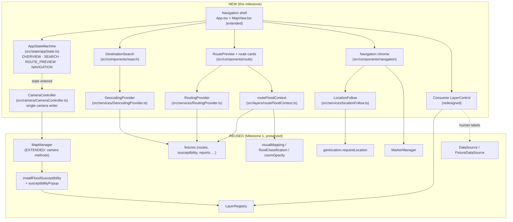
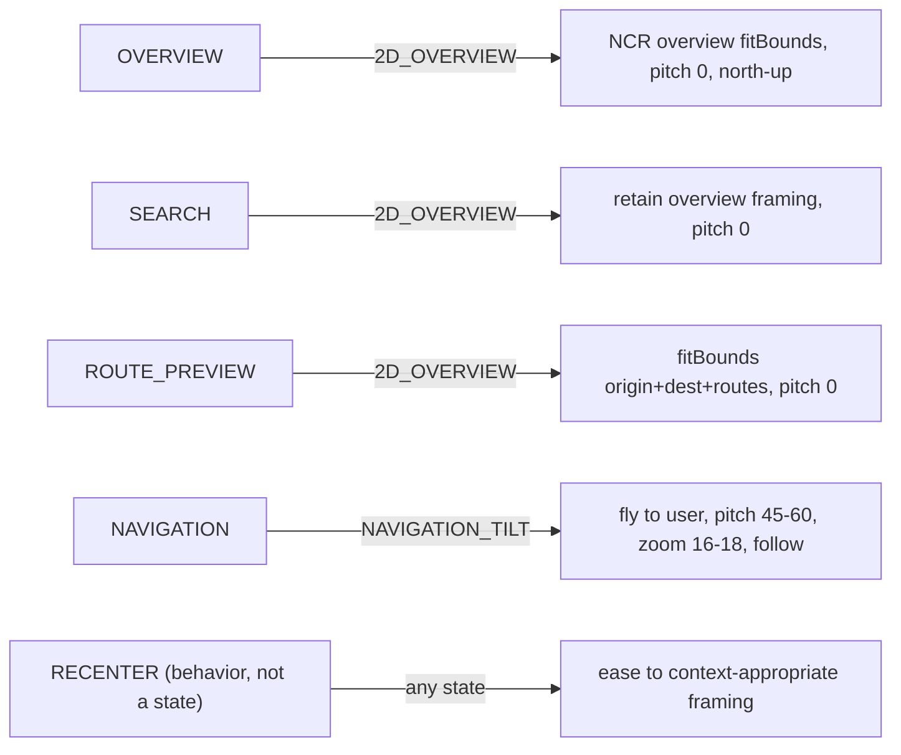
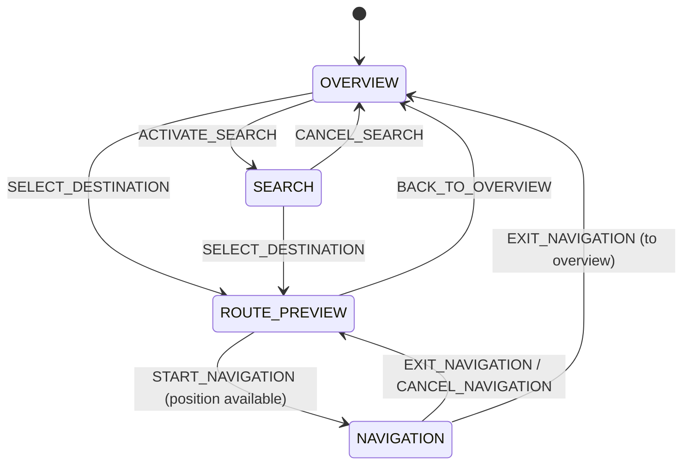
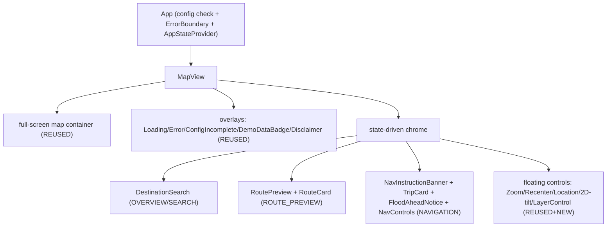

# Design Document — Navigation Experience

## Overview

This milestone turns the completed, verified **Milestone 1 map foundation** (`baharoute-metro-manila-map-foundation`) into a polished, Metro Manila-first, flood-aware **navigation application**. It is a **UX-correction and evolution**, not a rewrite: the existing Mapbox GL JS rendering core, flood data model, `DataLayer`/`DataSource` abstraction, `LayerRegistry`, susceptibility rendering, markers, overlays, geolocation service, responsive layout, and accessibility work are **preserved and reused**. This design adds a thin, testable set of new layers on top of that foundation.

### What changes

- A new explicit **App_State machine** (OVERVIEW → SEARCH → ROUTE_PREVIEW → NAVIGATION) as the single source of truth for interaction mode (Req 10).
- A new **CameraController** that becomes the **single writer** of the Mapbox GL JS camera during state transitions, with named Camera_Behaviors RECENTER / 2D_OVERVIEW / NAVIGATION_TILT (Req 1, 2, 10, 11, 12).
- A redesigned **navigation shell**: full-screen map, floating "Where are you going?" search, compact rounded floating controls, bottom sheets, safe-area handling, desktop map-first layout with an optional left panel; the oversized `<h1>` header is removed (Req 3, 4, 17, 18, 19).
- **Destination search** behind a `GeocodingProvider` interface with a fixture-backed Metro Manila implementation and NCR prioritization (Req 8, 21).
- **Route preview** behind a `RoutingProvider` interface reusing the existing route fixtures, with a new pure **route flood-context** function and route cards showing ETA/distance/flood context (Req 9, 21).
- A **navigation follow mode**: START transition, continuous `LocationFollow` behind an interface, next-maneuver banner, trip card, exit action, and a flood-information-ahead notice (Req 11, 13, 14, 15).
- A **consumer-grade layer control** replacing the raw checkbox list (Req 4, 16).

### What is preserved from Milestone 1

Everything in `src/map`, `src/layers`, `src/services`, `src/types`, and `src/data/fixtures` is reused as-is wherever possible. `MapManager` is **extended** (camera methods added to its interface) rather than duplicated. `App.tsx` and `MapView.tsx` are **extended** to host the new state machine and shell. Only `LayerControl.tsx` is **redesigned** (its `onToggle → LayerRegistry.setVisibility` wiring is kept). All Milestone 1 tests must stay green (Req 20).

### Out of scope (stubbed behind interfaces)

Real turn-by-turn routing, real GPS-driven movement, real geocoding, and live flood data are **out of scope** and supplied by fixtures/stubs behind interfaces so real providers can replace them without changing consumers (Req 21.3, 21.4). Route and geocode data are always treated and labeled as demo (Req 8.7, 9.8, 21.5). A development/demo movement simulation may exist but production must never fabricate GPS (Req 13.4, 13.5).

Fixed stack (unchanged from Milestone 1 except the map provider, see below): React 18 + TypeScript + Vite + Mapbox GL JS (direct `mapbox-gl` integration); Vitest + React Testing Library + fast-check for tests, with jsdom (no WebGL) so map/geolocation/provider logic is tested through injected fakes.

### Map provider

A provider migration was performed during Milestone A: the map rendering engine moved from MapLibre GL JS + MapTiler to **Mapbox GL JS**. Product logic, flood semantics, and the camera abstraction are unaffected — the swap is confined to the rendering engine, its style asset, and the access-token env var.

- **OLD (Milestone 1):** MapLibre GL JS + MapTiler tiles, keyed by `VITE_MAPTILER_KEY`, with a hand-authored OpenMapTiles vector style.
- **NEW:** Mapbox GL JS via the direct `mapbox-gl` package (not `react-map-gl`), using the stock style `mapbox://styles/mapbox/light-v11` and the access token `VITE_MAPBOX_ACCESS_TOKEN`. The token is applied at map construction via the `accessToken` map option.
- **Preserved:** `MapManager` remains the camera abstraction (single writer, watchdog, resize, zoom-clamp). GeoJSON/flood layers are unchanged and engine-agnostic (they rely on the shared GL JS style-spec — `["interpolate", …]` / `["match", …]` expressions and `addLayer(layer, beforeId)` insert-below semantics, which behave identically on Mapbox). The Metro Manila product camera is preserved: center `[120.9842, 14.5995]`, zoom ≈ 11.

### Licensing / billing

Mapbox GL JS v2+ is proprietary software governed by the Mapbox Terms of Service, and it bills **per map load** against the Mapbox account tied to `VITE_MAPBOX_ACCESS_TOKEN`. This is a deliberate, approved departure from the free/OSS MapLibre GL JS + MapTiler setup used in Milestone 1.

---

## Architecture

### High-level architecture

The new **App_State machine** and **CameraController** are layered *over* the preserved Milestone 1 core. The state machine is the single source of truth for interaction mode; the CameraController is the single writer of the camera; both consume the existing `MapManager`, `LayerRegistry`, and `DataSource` without replacing them.



Key architectural decisions:

- **Single source of truth for mode.** The `AppStateMachine` is a pure, React-independent module. React holds it via a reducer/context and renders chrome per state. Exactly one App_State is active (Req 10.2).
- **Single writer of the camera.** Only the `CameraController` calls camera-moving methods during state transitions (Req 10.5). It reads the target framing for the new state and applies it; components never move the camera directly.
- **Interfaces for out-of-scope providers.** `GeocodingProvider`, `RoutingProvider`, and `LocationFollow` are interfaces with fixture/stub implementations, so real providers drop in later without touching consumers (Req 21.3).
- **Reuse over rewrite.** `MapManager` gains camera methods but keeps its lifecycle, watchdog, resize, and zoom-clamp behavior. `LayerRegistry`, susceptibility install, markers, and all pure flood logic are untouched.

### App_State ↔ Camera_Behavior mapping



### Project structure (NEW vs REUSED)

```
src/
  state/                         NEW
    appState.ts                    AppState union + pure AppStateMachine (Req 10, 11)
  camera/                        NEW
    CameraController.ts            single camera writer; framing per state (Req 1,2,10,11,12)
    overviewFraming.ts             OVERVIEW bbox/padding constant (Req 1)
  components/
    App.tsx / MapView.tsx        EXTENDED  host state machine + shell, remove <h1>
    search/                      NEW
      DestinationSearch.tsx        "Where are you going?" (Req 8)
    route/                       NEW
      RoutePreview.tsx             route cards, ETA/distance/flood context (Req 9)
      RouteCard.tsx
    navigation/                  NEW
      NavInstructionBanner.tsx     next-maneuver (Req 14.1)
      TripCard.tsx                 ETA/distance/exit (Req 14.4)
      FloodAheadNotice.tsx         flood-information-ahead (Req 15)
      NavControls.tsx              recenter / 2D-tilt / layers / sound placeholder (Req 14.3)
    controls/
      LayerControl.tsx           REDESIGNED  consumer panel (Req 4,16)
  services/
    GeocodingProvider.ts         NEW  interface + FixtureGeocodingProvider (Req 8,21)
    RoutingProvider.ts           NEW  interface + FixtureRoutingProvider (Req 9,21)
    locationFollow.ts            NEW  watchPosition abstraction + demo source (Req 13)
    geolocation.ts               REUSED  requestLocation (Req 2,11.6,21)
  layers/
    routeFloodContext.ts         NEW  pure route↔flood association (Req 9.6,15)
    (LayerRegistry, floodSusceptibilityLayer, visualMapping, ...) REUSED
  map/ types/ data/fixtures/     REUSED
```

---

## Components and Interfaces

### 1. App State Architecture (Req 10, 11)

A typed `AppState` union and a pure `AppStateMachine` live in `src/state/appState.ts`, kept free of React so the transition logic is unit- and property-testable in isolation. React wraps it in a reducer/context.

```ts
// src/state/appState.ts
export type AppStateName = 'OVERVIEW' | 'SEARCH' | 'ROUTE_PREVIEW' | 'NAVIGATION';

export type AppEvent =
  | { type: 'ACTIVATE_SEARCH' }        // OVERVIEW → SEARCH (Req 8.5)
  | { type: 'SELECT_DESTINATION' }     // SEARCH|OVERVIEW → ROUTE_PREVIEW (Req 8.6)
  | { type: 'CANCEL_SEARCH' }          // SEARCH → OVERVIEW
  | { type: 'START_NAVIGATION' }       // ROUTE_PREVIEW → NAVIGATION (Req 11.1)
  | { type: 'START_TRANSITION_DONE' }  // clears the in-progress guard (Req 11.7)
  | { type: 'EXIT_NAVIGATION' }        // NAVIGATION → ROUTE_PREVIEW|OVERVIEW (Req 14.5)
  | { type: 'CANCEL_NAVIGATION' }      // NAVIGATION → ROUTE_PREVIEW (Req 11.8)
  | { type: 'BACK_TO_OVERVIEW' };

export interface AppState {
  readonly name: AppStateName;
  /** True while the START→NAVIGATION animation is in flight; blocks re-entry (Req 11.7). */
  readonly navTransitionInProgress: boolean;
  /** The state to return to on exit/cancel (Req 10.7, 11.8, 14.5). */
  readonly priorState: AppStateName | null;
}

export const INITIAL_APP_STATE: AppState = {
  name: 'OVERVIEW',                    // initial state OVERVIEW (Req 10.1)
  navTransitionInProgress: false,
  priorState: null,
};

/** Pure transition function. Returns the SAME reference on a no-op (Req 10.6). */
export function transition(state: AppState, event: AppEvent): AppState;

/** True iff the event is allowed from the current state. */
export function canTransition(state: AppState, event: AppEvent): boolean;
```

Transition rules:

- **Initial** state is OVERVIEW (Req 10.1); exactly one state active (Req 10.2).
- **No-op on same-state**: an event that targets the already-active state returns the *same* state object so the camera is not moved (Req 10.6).
- **Invalid transitions** (e.g. `START_NAVIGATION` from OVERVIEW) are rejected: `transition` returns the input state unchanged and `canTransition` returns false.
- **Return-to-prior framing**: `priorState` records where NAVIGATION was entered from; `EXIT_NAVIGATION`/`CANCEL_NAVIGATION` return there and the camera re-applies that state's first-entry framing (Req 10.7, 11.8, 14.5).
- **START re-entry guard**: while `navTransitionInProgress` is true, another `START_NAVIGATION` is ignored (Req 11.7); `START_TRANSITION_DONE` clears the guard.



### 2. Camera Controller (Req 1, 2, 10, 11, 12)

`CameraController` (`src/camera/CameraController.ts`) is the single component that changes the map camera during state transitions (Req 10.5). It depends on an extended `MapManager` camera surface (see below) so it is testable against a fake map that records calls.

```ts
// src/camera/CameraController.ts
export interface CameraTarget {
  center?: [number, number];
  zoom?: number;
  pitch?: number;      // 0 for 2D_OVERVIEW; 45-60 for NAVIGATION_TILT
  bearing?: number;    // 0 = north-up
  durationMs?: number;
}

export interface CameraMap {
  fitBounds(bounds: [[number, number], [number, number]], options?: unknown): void;
  easeTo(target: CameraTarget): void;
  flyTo(target: CameraTarget): void;
  setPitch(pitch: number): void;
  setBearing(bearing: number): void;
  getMap?(): unknown;
  /** True when the environment can render tilt; false → forced 2D (Req 12.6). */
  supportsTilt?(): boolean;
}

export class CameraController {
  constructor(map: CameraMap);
  /** Apply the framing defined for a state's entry (Req 10.4, 10.7). */
  applyStateFraming(state: AppStateName, ctx: CameraFramingContext): void;
  recenter(ctx: CameraFramingContext): void;          // RECENTER behavior (Req 2.3)
  toggle2DTilt(): void;                                // 2D/tilt toggle (Req 12.5)
  followUser(pos: { lng: number; lat: number }, heading?: number): void; // Req 13.2
}

export interface CameraFramingContext {
  origin?: { lng: number; lat: number };
  destination?: { lng: number; lat: number };
  routes?: GeoJSON.LineString[];
  userPosition?: { lng: number; lat: number };
  heading?: number;               // undefined → route/north-up fallback (Req 12.4)
  routeDirection?: number;
}
```

Framing per state / behavior:

- **OVERVIEW (2D_OVERVIEW)** — `fitBounds` to a **tuned NCR overview bbox** (see `overviewFraming.ts`), pitch 0, bearing 0. Metro Manila fills the majority of the viewport; provinces appear only at the edges (Req 1.2–1.4). The bbox is *slightly padded/tightened* relative to `METRO_MANILA_EXTENT` so the NCR is dominant without hard-clipping the basemap (the basemap continues to render beyond the box, Req 1.6).
- **SEARCH (2D_OVERVIEW)** — retains the overview framing; activating search does not move the camera by itself (Req 12.1).
- **ROUTE_PREVIEW (2D_OVERVIEW)** — `fitBounds` to the combined extent of origin + destination + displayed route(s), with padding, pitch 0 (Req 9.3, 12.1). Not left at overview framing.
- **NAVIGATION (NAVIGATION_TILT)** — animate toward the user within 2000 ms via `flyTo`, pitch 45–60°, street-level zoom 16–18 (Req 11.2). Not left at overview framing (Req 11.5). During follow, `easeTo` keeps center on the user and maintains zoom/pitch/bearing (Req 13.2).
- **RECENTER** — eases to the context-appropriate framing (overview bbox in OVERVIEW/SEARCH/ROUTE_PREVIEW; user in NAVIGATION). Reuses `MapManager.recenter` for the overview case.
- **Heading / bearing** — in NAVIGATION, bearing follows device heading when available; otherwise route direction; otherwise north-up (Req 12.3, 12.4).
- **2D fallback** — if `supportsTilt()` is false, the controller keeps pitch 0 and never forces tilt (Req 12.6). The 2D/tilt toggle flips between pitch 0 and the navigation pitch (Req 12.5).

`overviewFraming.ts` exports the overview constant, built from `METRO_MANILA_BOUNDS`:

```ts
// src/camera/overviewFraming.ts
export const OVERVIEW_FIT_PADDING = 24;                 // px padding so NCR fills viewport
export const OVERVIEW_BOUNDS = METRO_MANILA_EXTENT;     // reused; may be tuned/tightened
export function overviewFitOptions(): { padding: number; duration: number };
```

**MapManager extension.** `MinimalMap` gains optional camera methods and `MapManager` exposes thin pass-throughs so `CameraController` never duplicates `MapManager`:

```ts
// src/map/MapManager.ts (EXTENDED — additive, non-breaking)
export interface MinimalMap {
  /* existing members unchanged */
  flyTo?(options: unknown): unknown;
  easeTo?(options: unknown): unknown;
  setPitch?(pitch: number): unknown;
  setBearing?(bearing: number): unknown;
}
// MapManager adds: flyTo(), easeTo(), setPitch(), setBearing() that delegate to the map,
// each a no-op-safe wrapper (guarded like the existing recenter()).
```

Testability: `CameraController` is constructed with a fake `CameraMap` that records `fitBounds`/`flyTo`/`easeTo`/`setPitch`/`setBearing` calls, so tests assert the correct camera calls per state without WebGL.

### 3. Navigation Shell Architecture (Req 3, 4, 17, 18, 19)

`App.tsx` is extended to remove the `<header><h1>BahaRoute</h1></header>` block (Req 3.2, 3.3) and to host the `AppStateMachine` context. `MapView.tsx` keeps its `MapManager` lifecycle and existing seams (`createMapManager`, `mapFactory`, `dataSource`, `createMarkerManager`) and gains the state-driven chrome.

Component tree (state-driven):



- The map is the dominant full-screen element (Req 3.1); no blank header area is reserved (Req 3.2).
- Product identity is restrained chrome only — a small wordmark, never an oversized heading (Req 3.3).
- All primary controls are intentionally styled rounded floating controls, not browser defaults (Req 3.4), driven by `layout.css` tokens.
- No developer terminology or internal identifiers surface in the primary UI (Req 4.3); all layers/controls use human-readable labels (Req 4.4).
- Desktop (≥768px) keeps the map dominant and may show an optional left panel for search/route options (Req 18); mobile (<768px) floats search at top and uses bottom sheets/cards (Req 17). No permanent sidebar or GIS dashboard layout (Req 17.6, 18.3).

### 4. Search Architecture (Req 8, 21)

```ts
// src/services/GeocodingProvider.ts
export interface GeocodePlace {
  id: string;
  name: string;                 // human place name (Req 8.2) — never lat/lng shown to user
  location: { lng: number; lat: number };
  withinNCR: boolean;           // used for prioritization (Req 8.3)
  isDemo: true;                 // demo data (Req 8.7, 21.5)
}
export interface GeocodeResults {
  places: GeocodePlace[];       // Metro Manila prioritized first (Req 8.3)
  outOfNCRQuery: boolean;       // drives the "focused on Metro Manila" message (Req 8.4)
}
export interface GeocodingProvider {
  search(query: string): Promise<GeocodeResults>;
}
export class FixtureGeocodingProvider implements GeocodingProvider { /* demo NCR places */ }
```

- `FixtureGeocodingProvider` is backed by a small demo set of Metro Manila places (e.g. Makati CBD, Quezon City Circle, Manila City Hall) plus a few out-of-NCR entries used to exercise degradation. It ranks NCR results first using `isWithinMetroManila` / an NCR bbox (Req 8.3).
- If the query resolves only to destinations far outside the NCR, `outOfNCRQuery` is set and the UI shows a message that BahaRoute's flood-aware coverage is focused on Metro Manila, without claiming nationwide coverage (Req 8.4).
- `DestinationSearch` renders the prominent "Where are you going?" prompt over the map (Req 8.1). Selecting a result dispatches `SELECT_DESTINATION` (Req 8.6); activating the field dispatches `ACTIVATE_SEARCH` (Req 8.5). No latitude/longitude, raw GeoJSON, or internal identifiers are entered or shown (Req 8.2, 4.3).
- Results are labeled/treated as demo (Req 8.7, 21.5).

### 5. Route Preview Architecture (Req 9, 21)

```ts
// src/services/RoutingProvider.ts
export interface RouteWithContext {
  route: Route;                 // REUSED Milestone 1 Route type
  etaSeconds: number;
  distanceMeters: number;
  floodContext: RouteFloodContext;
  isDemo: true;                 // demo data (Req 9.8, 21.5)
}
export interface RoutePlan {
  origin: { lng: number; lat: number };
  destination: { lng: number; lat: number };
  selected: RouteWithContext;
  alternatives: RouteWithContext[];   // may be empty; same interface (Req 9.2)
}
export interface RoutingProvider {
  plan(origin: GeocodePlace | { lng: number; lat: number },
       destination: GeocodePlace): Promise<RoutePlan>;
}
export class FixtureRoutingProvider implements RoutingProvider { /* uses routeFixtures */ }
```

- `FixtureRoutingProvider` uses the existing `routeFixtures` / `routeAlternativeFixture`; it selects one route as dominant and offers the rest as alternatives (Req 9.1, 9.2, 9.4).
- `RoutePreview` renders route cards: the selected route visually dominant, alternatives secondary (Req 9.4). Each card shows ETA, distance, and Route_Flood_Context (Req 9.6). No "Safest Route", "Guaranteed Safe", numeric safety score, or Google Maps pixel-for-pixel layout (Req 9.5, 9.7).
- On entry, the `CameraController` fits origin + destination + route(s) (Req 9.3).

**Route flood-context (pure function).** `src/layers/routeFloodContext.ts` associates a route's geometry with the susceptibility fixtures and flood reports — a simple proximity/segment-sampling approach, **not** a routing engine:

```ts
// src/layers/routeFloodContext.ts
export interface RouteFloodContext {
  highSusceptibilitySections: number;   // count of HIGH-susceptibility polygons intersected
  recentReportCount: number;            // recent flood reports near the route (Req 9.6)
  unknownProportion: number;            // in [0,1] — fraction of sampled points with no info
}
export function computeRouteFloodContext(
  route: Route,
  susceptibility: FloodSusceptibility[],
  reports: FloodReport[],
  now: number,
  recency: RecencyConfig,
): RouteFloodContext;
```

Approach: sample points along the route `LineString`; a HIGH-susceptibility section is counted when a sampled point falls inside (or within a small buffer of) a HIGH polygon; `recentReportCount` counts reports within a proximity threshold whose age is within the recency window (reusing `classifyFloodState`/recency semantics); `unknownProportion` = (sampled points with neither nearby recent report nor susceptibility coverage) / (total sampled points), always in `[0,1]`. It never emits a "safe"/"clear"/score label (Req 9.7, 7.4).

### 6. Navigation Mode Architecture (Req 11, 13, 14)

```ts
// src/services/locationFollow.ts
export type FollowUpdate =
  | { status: 'position'; lng: number; lat: number; heading?: number }
  | { status: 'denied' } | { status: 'unavailable' } | { status: 'timeout' };

export interface PositionWatchSource {
  watch(onUpdate: (u: FollowUpdate) => void): () => void;   // returns stop()
}
/** Wraps navigator.geolocation.watchPosition() behind the interface. */
export class BrowserPositionWatch implements PositionWatchSource { /* ... */ }
/** Demo/simulation source, kept separate from production (Req 13.5). */
export class SimulatedPositionWatch implements PositionWatchSource { /* replays a path */ }

export interface LocationFollow {
  start(onUpdate: (u: FollowUpdate) => void): void;
  stop(): void;
  readonly active: boolean;
}
```

- START: pressing START in ROUTE_PREVIEW first checks position availability via the existing `requestLocation`. If unavailable/denied/timeout, the app stays in ROUTE_PREVIEW, shows "navigation cannot follow your position", and does **not** start follow (Req 11.6, 21.2). Otherwise it dispatches `START_NAVIGATION`, the `CameraController` runs the tilt/fly transition, and `LocationFollow.start` begins (Req 11.1–11.4). The re-entry guard blocks double START (Req 11.7).
- `LocationFollow` wraps `watchPosition` behind `PositionWatchSource` (injectable, mirroring `requestLocation`). Production uses `BrowserPositionWatch`; a separate `SimulatedPositionWatch` drives demo movement and is never used in production (Req 13.1, 13.4, 13.5).
- Each position update moves the Current_Location_Marker via the reused `MarkerManager` (its origin marker doubles as current-location), keeps route/destination visible, maintains nav zoom/pitch/bearing, and updates ETA/remaining distance where trip-progress data exists (Req 13.2, 13.3).
- `NavInstructionBanner` shows the next maneuver (fixture maneuvers for now, e.g. "Continue on Commonwealth Avenue • 1.2 km") (Req 14.1). `TripCard` shows ETA, remaining distance, estimated arrival, and Exit (Req 14.4). Exit leaves NAVIGATION for ROUTE_PREVIEW or OVERVIEW (Req 14.5). `NavControls` offers recenter, 2D/tilt toggle, layers, and a sound placeholder (Req 14.3).

### 7. Flood Integration (Req 5, 6, 7, 15)

- **Overview**: reuse `installFloodSusceptibility` + zoom-faded opacity so susceptibility shows by default as a translucent, zoom-dependent overlay with roads/labels readable underneath (Req 5.1, 5.2). OVERVIEW never shows a bare basemap with all flood layers off (Req 5.3). Where current/recent flood info exists it is shown too (Req 5.4).
- **Distinct concepts**: susceptibility stays translucent polygons; current conditions render as route segments/markers (Req 6.1, 6.2). City boundaries are never used as risk polygons (Req 6.3) — already enforced by separate fixtures.
- **Route-context visualization**: color route segments by `RouteFloodSegment.state` reusing `FLOOD_STATE_COLORS` + `floodStateLabel` (Req 6.1, 7.2).
- **Flood-information-ahead notice** (`FloodAheadNotice`): shown during NAVIGATION only when relevant to the path ahead (Req 15.1). It includes distance ahead, road, condition, reported time, source, and verification status, marking Community_Report content UNCONFIRMED (Req 15.2). It offers view-details and view-alternative actions (Req 15.3), never permanently covers the map (Req 15.4), and never triggers an automatic reroute from a single unconfirmed report (Req 15.5).
- **Vocabulary/labels**: susceptibility RED/ORANGE/YELLOW → High/Moderate/Low (Req 7.1); current states use the Req 7.2 labels; GREEN only with recent passability evidence (Req 7.3, via `classifyFloodState`); absent info stays GRAY "Unknown", never "No Risk"/"Safe"/"Clear" (Req 7.4). Reuses `floodClassification`, `visualMapping`, `FloodPopup`, `Disclaimer`.

#### 7a. City-level susceptibility SUMMARY layer (NCR overview composition)

An **additive** layer reproduces the NCR overview **composition** — a filled, color-coded 17-city silhouette over the light basemap, Metro Manila dominant — while preserving BahaRoute flood semantics. It is intentionally distinct from the two existing flood concepts:

- **What it is**: a per-city **MODELED / HISTORICAL susceptibility SUMMARY**. Each of the 17 NCR jurisdictions is assigned a single HIGH / MODERATE / LOW class and drawn as a translucent fill on its administrative silhouette. It is **not** current flooding, and absence of a fill (or a LOW fill) never reads as "safe"/"passable".
- **Distinct from current conditions** (flood reports / route segments / markers) **and from the hazard-shaped `floodSusceptibility` polygons** (waterway/low-lying hazard geometry). Drawing the summary on the city **administrative** silhouette is allowed **here** because the value drawn is an explicitly labeled per-city susceptibility *summary*, not a hazard footprint; the hazard-shaped polygons remain the authoritative hazard geometry and render **on top** of this summary.
- **Boundary geometry & provenance**: the silhouette geometry is the **REAL** Metro Manila city boundary geometry, sourced from the Roberto project's `data/city_boundaries.geojson` (public NCR administrative boundaries), **adapted** (normalized to a `properties.city_norm` per feature) and **stored locally** at `src/data/geojson/metroManilaCityBoundaries.geojson`. It is read at **build time** (Vite `?raw` import + `JSON.parse` in `metroManilaCityBoundaries.ts`) — never fetched from GitHub or any network endpoint at runtime. The dataset is a `FeatureCollection` of 17 features whose geometry is `Polygon` **or** `MultiPolygon`; the Mapbox `fill` layer renders both intact.
- **Administrative boundary ≠ flood data**: these polygons are **administrative** city boundaries. **The geometry itself does NOT represent flood conditions**, susceptibility, or any hazard footprint — only the clearly labeled, modeled per-city SUMMARY VALUE does. Absence of a fill (or a LOW fill) never reads as "safe"/"passable".
- **Palette**: BahaRoute's reserved `SUSCEPTIBILITY_COLORS` — HIGH = translucent red, MODERATE = translucent orange, LOW = translucent yellow. **No GREEN** (green is the current-condition "Recently Reported Passable" state and must never appear on a susceptibility layer). This deliberately diverges from the reference's color semantics: we match the *composition*, not the reference's use of green.
- **Modules**: `data/geojson/metroManilaCityBoundaries.ts` (typed loader for the local `.geojson` asset), `data/geojson/cityNameNormalization.ts` (explicit `city_norm` → `{ id, name }` map handling accent/variant cases: `QUEZON`→Quezon City, `LAS PINAS`→Las Piñas, `PARANAQUE`→Parañaque), `data/fixtures/cityFloodSusceptibility.ts` (pairs each **real** boundary polygon — matched by normalized `city_norm` — with its approved demo class; `dataType: 'SUSCEPTIBILITY'`, demo source, UNCONFIRMED; **throws** if a `city_norm` cannot be normalized or a class is missing, so coverage stays honest), a `cityFloodSummary` `DataLayer` in `dataLayers.ts` (human label "City flood susceptibility (modeled)"), `layers/cityFloodSummaryLayer.ts` (translucent `fill` + subtle outline + `installCityFloodSummary`), and `layers/cityFloodSummaryPopup.ts` (reuses `FloodPopup` susceptibility variant so a city click shows Area = city name, Data type = Susceptibility, level, Source, Dataset date, and the historical-exposure disclaimer).
- **Z-order**: registered via `LayerRegistry` as the **lowest app layer** (`cityFloodSummary` appended to `APP_LAYER_ORDER`), just above the basemap and **below** the hazard-shaped `floodSusceptibility` polygons and all reports/routes. Rendered by default so flood awareness is visible in OVERVIEW (Req 5). Camera/framing is unchanged.

### 8. Consumer Layer Control Redesign (Req 4, 16)

`LayerControl.tsx` is **redesigned** from a permanently visible raw checkbox list into a compact floating **button that opens a small menu** on demand (Req 16.1, 16.2). It keeps the existing `onToggle(id, visible) → LayerRegistry.setVisibility` wiring (Req 16 preserves the Milestone 1 Layer_Control interface).

- Human-readable labels only — a `LayerId → friendly label` map ("Flood susceptibility", "Recent flood reports", "Community reports", "Evacuation centers"); no internal identifiers, no raw checkbox list in the primary UI, no "On"/"Off" text as the affordance (Req 4.1, 4.2, 16.3). The menu uses styled toggle switches with labels.
- Default (OVERVIEW) shows susceptibility as visible plus current flood info where available; optional layers (community reports, evacuation centers, detailed route layers) start hidden (Req 16.4, 16.5).
- The existing `DataLayerMeta.label` is already human text; the redesign additionally hides any developer-ish ids from view and presents the curated labels.

### 9. Responsive Behavior (Req 17, 18)

`layout.css` is extended (keeping the 768px breakpoint and safe-area/44×44 tokens) with tokens/classes for: the floating search bar, bottom sheets, the nav banner, the trip card, and the layer panel.

- Mobile (<768px): map occupies nearly the full screen; search floats at top; route options are bottom sheets/cards; ROUTE_PREVIEW stays map-dominant; NAVIGATION shows the nav banner at top and a compact bottom trip card; floating controls stay thumb-reachable, respect safe areas, and never overlap (Req 17.1–17.5). No permanent sidebar / raw checkbox panel / squeezed desktop layout (Req 17.6).
- Desktop (≥768px): larger map stays dominant with an optional left panel; no analytics/GIS dashboard layout (Req 18).

---

## Data Models

New types introduced this milestone (they build on, and reuse, the Milestone 1 `Route`, `FloodSusceptibility`, `FloodReport`, `RouteFloodSegment`, `RecencyConfig`, `GeoLocation`):

```ts
// src/state/appState.ts
export type AppStateName = 'OVERVIEW' | 'SEARCH' | 'ROUTE_PREVIEW' | 'NAVIGATION';
export interface AppState {
  name: AppStateName;
  navTransitionInProgress: boolean;
  priorState: AppStateName | null;
}

// src/camera/CameraController.ts
export type CameraBehavior = 'RECENTER' | '2D_OVERVIEW' | 'NAVIGATION_TILT';
export interface CameraTarget { center?: [number, number]; zoom?: number; pitch?: number; bearing?: number; durationMs?: number; }

// src/services/GeocodingProvider.ts
export interface GeocodePlace { id: string; name: string; location: GeoLocation; withinNCR: boolean; isDemo: true; }
export interface GeocodeResults { places: GeocodePlace[]; outOfNCRQuery: boolean; }

// src/services/RoutingProvider.ts
export interface RouteWithContext { route: Route; etaSeconds: number; distanceMeters: number; floodContext: RouteFloodContext; isDemo: true; }
export interface RoutePlan { origin: GeoLocation; destination: GeoLocation; selected: RouteWithContext; alternatives: RouteWithContext[]; }

// src/layers/routeFloodContext.ts
export interface RouteFloodContext {
  highSusceptibilitySections: number;   // >= 0
  recentReportCount: number;            // >= 0
  unknownProportion: number;            // in [0,1]
}

// src/services/locationFollow.ts
export type FollowUpdate =
  | { status: 'position'; lng: number; lat: number; heading?: number }
  | { status: 'denied' } | { status: 'unavailable' } | { status: 'timeout' };

// src/components/navigation/NavInstructionBanner.tsx
export interface NavInstruction { road: string; maneuver: string; remainingToManeuverMeters: number; }
```

Constraints encoded in the models: `unknownProportion ∈ [0,1]`; counts are non-negative integers; provider results carry `isDemo: true`; `RouteWithContext.route` is the unchanged Milestone 1 `Route`; `FollowUpdate` mirrors the `requestLocation` discriminated result so degradation paths are uniform.

---

## Existing-Code Preservation

Each concern maps to REUSE (unchanged), EXTEND (additive), NEW, or REPLACE. Avoiding unnecessary rewrites is a first-class goal (Req 20.1).

| Concern | Disposition | Files |
| --- | --- | --- |
| Mapbox GL JS lifecycle, watchdog, resize, zoom clamp | EXTEND (add `flyTo`/`easeTo`/`setPitch`/`setBearing` to `MinimalMap` + `MapManager`) | `src/map/MapManager.ts` |
| NCR extent / center / containment | REUSE | `src/map/metroManilaExtent.ts` |
| Quiet basemap style + zoom bounds + color tokens | REUSE | `src/map/basemap/BahaRouteStyle.ts`, `basemap/colorTokens.ts` |
| App shell (config check, ErrorBoundary) | EXTEND (remove `<h1>` header, host AppStateProvider) | `src/App.tsx` |
| Map wrapper + control cluster + overlays wiring | EXTEND (state-driven chrome; keep seams) | `src/components/MapView.tsx` |
| Error boundary | REUSE | `src/components/ErrorBoundary.tsx` |
| Layer control (raw checkbox list) | REPLACE / REDESIGN (keep `onToggle→setVisibility` wiring) | `src/components/controls/LayerControl.tsx` |
| Location / Recenter / Zoom controls | REUSE (recenter now routed via CameraController) | `src/components/controls/*` |
| Origin/destination/current-location markers | REUSE (current-location uses MarkerManager origin) | `src/components/markers/*` |
| Overlays (ConfigIncomplete, DemoDataBadge, Disclaimer, ErrorMessage, FloodPopup, LoadingIndicator) | REUSE | `src/components/overlays/*` |
| Layer ordering / z-index | REUSE | `src/layers/LayerRegistry.ts` |
| Susceptibility install + popup | REUSE | `src/layers/floodSusceptibilityLayer.ts`, `susceptibilityPopup.ts` |
| Flood classification, visual mapping, zoom opacity | REUSE | `src/layers/floodClassification.ts`, `visualMapping.ts`, `zoomOpacity.ts` |
| DataLayer/DataSource + fixtures | REUSE | `src/services/FixtureDataSource.ts`, `src/layers/dataLayers.ts`, `src/data/fixtures/*` |
| Env config loader | REUSE | `src/services/env.ts` |
| Geolocation (single fix) | REUSE | `src/services/geolocation.ts` |
| Types (flood/report/route/evacuation/layer/config) | REUSE | `src/types/*` |
| Responsive layout / focus ring / safe areas | EXTEND (add search/sheet/nav/trip/layer-panel tokens) | `src/styles/layout.css` |
| App state machine | NEW | `src/state/appState.ts` |
| Camera controller + overview framing | NEW | `src/camera/CameraController.ts`, `overviewFraming.ts` |
| Destination search | NEW | `src/services/GeocodingProvider.ts`, `src/components/search/*` |
| Route preview + flood context | NEW | `src/services/RoutingProvider.ts`, `src/layers/routeFloodContext.ts`, `src/components/route/*` |
| Location follow + navigation chrome | NEW | `src/services/locationFollow.ts`, `src/components/navigation/*` |

---

## Error Handling

| Failure | Handling | Requirement |
| --- | --- | --- |
| Geolocation denied/unavailable/timeout at startup | Stay in OVERVIEW, keep NCR framing, stay interactive | 2.4, 21.1 |
| START pressed with position unavailable | Remain in ROUTE_PREVIEW, show "cannot follow your position", do not start follow | 11.6, 21.2 |
| Position lost mid-navigation (watch error) | Keep last marker, surface a degraded-follow message; never fabricate GPS | 13.4, 21.2 |
| Double START during transition | Re-entry guard ignores the second press; no restart | 11.7 |
| Tilt unsupported by environment | Keep 2D, never force tilt | 12.6 |
| Device heading unavailable in navigation | Use route direction, else north-up | 12.4 |
| Search resolves only outside NCR | Show Metro-Manila-focus message; no nationwide claim | 8.4 |
| Search returns no results | Empty state; no error/crash | 8 (graceful) |
| No route alternatives available | Show selected route only; architecture keeps alternative slot | 9.2 |
| Malformed/empty fixtures | Reuse Milestone 1 skip-malformed / empty-collection handling | 20.1 (inherited 18.2, 18.3) |
| Missing API key | Reuse ConfigIncomplete path; shell renders, no tiles | 20.1 (inherited 17.4) |
| Tile load failure / 15s timeout | Reuse MapManager watchdog → ErrorMessage; app stays interactive | 20.1 (inherited 1.6, 18.1) |
| Provider (geocode/route) rejects | Caught; show demo-data empty/error state; app stays usable | 21.3 |

The reused React error boundary still wraps the map subtree. New provider calls are wrapped so a rejection degrades gracefully rather than crashing (consistent with the Milestone 1 best-effort integration pattern).

---

## Correctness Properties

*A property is a characteristic or behavior that should hold true across all valid executions of a system — essentially, a formal statement about what the system should do. Properties serve as the bridge between human-readable specifications and machine-verifiable correctness guarantees.*

We apply property-based testing to this milestone's genuinely **pure logic**: the `AppStateMachine` transition function (`src/state/appState.ts`), the search prioritization ordering, and the `routeFloodContext` computations (`src/layers/routeFloodContext.ts`). Camera movement, geolocation/follow, search messaging, UI wording, and responsive layout are UI/side-effect/config concerns covered by example, component, integration, and smoke tests (see Testing Strategy), **not** property tests.

Reflection applied: the same-state no-op (Req 10.6) and the START-in-progress guard (Req 11.7) are unified into one "no-op transitions return the same reference" property since both assert the identity/no-move rule. The state-range invariant, the return-to-prior bookkeeping, the search ordering, and the three route-flood-context properties are each independent and retained.

### Property 1: App_State stays within the closed four-state set

*For any* sequence of `AppEvent`s applied from `INITIAL_APP_STATE` via `transition`, the resulting `state.name` is always exactly one of `{OVERVIEW, SEARCH, ROUTE_PREVIEW, NAVIGATION}` and never any other value, with exactly one active at a time.

**Validates: Requirements 10.1, 10.2**

### Property 2: No-op transitions return the same state reference (no camera move)

*For any* `AppState` and *any* `AppEvent` that targets the already-active state or is blocked (including `START_NAVIGATION` while `navTransitionInProgress` is true, and any invalid event for the current state), `transition` returns the identical input `AppState` reference, so no camera movement is triggered.

**Validates: Requirements 10.6, 11.7**

### Property 3: Returning to a prior state restores that state's framing context

*For any* entry into `NAVIGATION` from a source state S, applying `EXIT_NAVIGATION`/`CANCEL_NAVIGATION` yields a state whose `name` equals the recorded `priorState` (S or OVERVIEW), so the same first-entry framing rules for that state are re-applied on return.

**Validates: Requirements 10.7, 11.8**

### Property 4: Search results prioritize Metro Manila ahead of non-NCR

*For any* set of `GeocodePlace` results, after ranking, every place with `withinNCR === true` appears before every place with `withinNCR === false`.

**Validates: Requirements 8.3**

### Property 5: Unknown proportion is always a valid fraction

*For any* `Route` and *any* collections of susceptibility polygons and flood reports, `computeRouteFloodContext(...).unknownProportion` is a real number in the closed interval `[0, 1]`.

**Validates: Requirements 9.6**

### Property 6: No reports yields zero count and never a "clear"/"safe" label

*For any* `Route` with no recent flood reports within the proximity/recency threshold, `computeRouteFloodContext(...).recentReportCount` equals `0`, and the returned context contains no safety score and no "safe"/"clear"/"no risk" label field — the absence of reports is never rendered as safety.

**Validates: Requirements 9.7, 7.4**

### Property 7: High-susceptibility section count is monotonic in intersecting HIGH polygons

*For any* `Route` and susceptibility set, adding a HIGH-susceptibility polygon that intersects the route never decreases `computeRouteFloodContext(...).highSusceptibilitySections`, and adding one that does not intersect leaves it unchanged; the count is always a non-negative integer.

**Validates: Requirements 9.6**

---

## Testing Strategy

BahaRoute uses a **dual approach**: property-based tests for universal properties over pure logic, and example / component / integration / smoke tests for concrete behavior, UI, browser APIs, and configuration. Unit tests focus on specific examples, edge cases, and integration points; property tests handle broad input coverage. **All Milestone 1 tests must stay green** (Req 20.1, 20.2).

### Tooling

- **Vitest** (`vitest --run`, single-shot), **React Testing Library**, **fast-check** — all already in the project. We do not implement PBT from scratch.
- jsdom has no WebGL, so map, geolocation, follow, and provider seams are exercised through **injected fakes** (matching the existing `createMapManager`/`mapFactory`/`dataSource`/`GeolocationSource` patterns).

### Property-based tests (pure logic)

Each property maps to a **single** property test, **minimum 100 iterations**, tagged with a comment referencing the design property.

Tag format: `// Feature: baharoute-navigation-experience, Property {number}: {property_text}`

| Property | Function under test | Generators |
| --- | --- | --- |
| P1 | `transition` fold | random `AppEvent` sequences from initial state |
| P2 | `transition` | random states + same-target/blocked/invalid events |
| P3 | `transition` (enter/exit) | random source state → START → EXIT/CANCEL |
| P4 | search ranking | random `GeocodePlace[]` with mixed `withinNCR` |
| P5 | `computeRouteFloodContext` | random routes + susceptibility + reports + now/recency |
| P6 | `computeRouteFloodContext` | routes with no in-threshold reports |
| P7 | `computeRouteFloodContext` | routes + incremental intersecting/non-intersecting HIGH polygons |

### Example / component tests (React Testing Library + fakes)

- **State transitions**: initial state OVERVIEW (Req 10.1); no-op and invalid transitions do not call the CameraController; return-to-prior re-applies framing (Req 10.6, 10.7).
- **Camera-state behavior**: with a fake `CameraMap`, `applyStateFraming` issues `fitBounds(OVERVIEW_BOUNDS, padding)` for OVERVIEW/SEARCH, `fitBounds` over origin+dest+routes for ROUTE_PREVIEW, and `flyTo` with pitch 45–60 + zoom 16–18 for NAVIGATION; assert no extra zoom writes (Req 1.2, 9.3, 10.4, 10.5, 11.2, 11.5, 12.1).
- **2D/tilt toggle + fallbacks**: toggle flips pitch 0 ↔ nav pitch (Req 12.5); `supportsTilt() === false` stays 2D and never forces tilt (Req 12.6); bearing selection order heading → routeDirection → north-up (Req 12.3, 12.4).
- **Search flow**: NCR prioritization surfaced in the list (Req 8.3); out-of-NCR query shows the Metro-Manila-focus message with no "nationwide" text (Req 8.4); no lat/lng or GeoJSON input; results labeled demo (Req 8.2, 8.7).
- **Route preview**: renders selected route dominant + alternatives secondary (Req 9.4); shows ETA, distance, and flood context (Req 9.6); no "Safest"/"Guaranteed Safe"/score text (Req 9.7); alternative-less plan still renders (Req 9.2).
- **START transition**: state change + camera fly + follow start on available position; position-unavailable path stays in ROUTE_PREVIEW, shows the message, and does not start follow (Req 11.1–11.6); double START ignored (Req 11.7).
- **Location follow**: fake `PositionWatchSource` emits positions → `MarkerManager.setOrigin` called per update and camera `easeTo` maintains nav framing (Req 13.1, 13.2); denied/unavailable prevents follow (Req 21.2); production wiring uses `BrowserPositionWatch`, sim is a separate class (Req 13.4, 13.5).
- **Navigation UI**: nav banner, trip card (ETA/distance/exit), nav controls (recenter/2D-tilt/layers/sound placeholder); exit returns to prior state (Req 14).
- **Flood-information-ahead**: shows distance/road/condition/reported-time/source/verification, marks community content UNCONFIRMED; view-details + view-alternative actions; never permanently covers the map; no auto-reroute from one unconfirmed report (Req 15).
- **Flood wording sweep**: scan rendered chrome across states for forbidden strings ("safe", "safest", "clear", "no risk", numeric score); GRAY stays "Unknown"; UNCONFIRMED shown (Req 7.4, 9.7, 19.3).
- **Layer control**: closed by default, opens on demand; human labels only, no raw checkbox list / "On"/"Off" affordance / internal ids in primary UI; toggle still calls `LayerRegistry.setVisibility`; susceptibility visible by default, optional layers hidden (Req 4.1–4.4, 16).
- **Shell**: no oversized `<h1>` heading / blank header; map is the dominant element; rounded floating controls (Req 3).
- **Responsive layout**: structural class assertions per state (search top, bottom sheets, nav banner top, trip card bottom) + CSS token contract (768px breakpoint, safe-area, 44×44); no permanent sidebar / raw checkbox panel (Req 17, 18).

### Integration tests (with fakes / reused install)

- On ready with an integrable map, `installFloodSusceptibility` runs and OVERVIEW is not a bare basemap (Req 5.1, 5.3).
- Route segments colored by `RouteFloodSegment.state` reuse `FLOOD_STATE_COLORS`/`floodStateLabel` (Req 6.1, 7.2).

### Smoke / gate

- `tsc --noEmit`, `eslint`, `vitest --run`, and `vite build` all pass; `.env.local` stays ignored and no API key is committed (Req 20.2, 20.3).

### Why some criteria are not property-tested

Camera framing/animation, tile rendering, geolocation and `watchPosition`, search messaging, navigation chrome, flood-ahead notice, layer-panel interaction, responsive layout, and the visual identity test **UI rendering, browser APIs, external Mapbox GL JS behavior, or one-time configuration**. Their behavior does not vary meaningfully across generated inputs in a way 100 iterations would surface, so they use example, component, integration, or smoke tests instead.

---

## Visual Verification Strategy (manual)

Visual verification is **manual** and **not covered by the automated suite**: it requires a real MapTiler key + WebGL, which jsdom/CI cannot provide. Run `npm run dev` with a valid `VITE_MAPTILER_KEY` and check:

- **Default Metro Manila framing** — NCR dominant, the 17 cities in view, provinces only at the edges, no hard clip at the NCR boundary (Req 1).
- **Search-first UX** — prominent "Where are you going?" over the map; NCR results first; out-of-NCR message honest (Req 8).
- **Route preview** — selected route dominant, alternatives secondary, ETA/distance/flood context readable, no safety-score wording (Req 9, 19).
- **Navigation mode** — START tilts the camera (pitch 45–60, zoom 16–18) and follows; nav banner + trip card visible; flood-ahead notice non-blocking (Req 11–15).
- **Flood visibility** — translucent susceptibility over a readable basemap; roads/labels legible underneath; susceptibility vs current conditions visually distinct (Req 5, 6).
- **Mobile usability** — map-dominant, thumb-reachable controls, safe-area insets respected, no overlapping controls; bottom sheets sized well (Req 17).

This checklist complements, and does not replace, the automated tests above.
